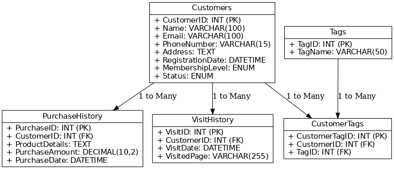
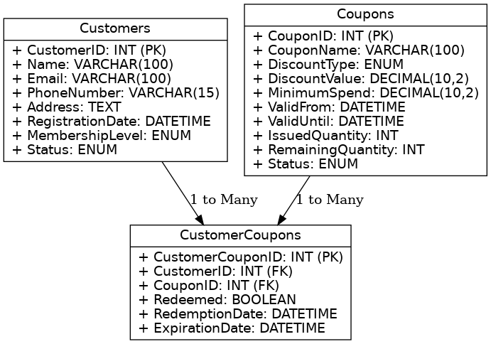

客戶管理功能設計
設計一套 CRM 系統，請回答以下問題：

1.  如何設計「客戶表」的資料庫結構？該表應包含哪些基本資訊（如姓名、聯絡方式）、以及行為資訊（如偏好標籤、消費記錄）？

    

2.  優惠券系統設計

    - 優惠券的資料表應有哪些關鍵欄位？請說明並舉例其用途。<br/><br/>
      
      Coupons（優惠券表）<br/>
      CouponID (PK) INT 優惠券唯一識別碼 <br/>
      CouponName VARCHAR(100) 優惠券名稱（例如「滿 500 減 50」） <br/>
      DiscountType ENUM 折扣類型（例如「金額折扣」、「百分比折扣」） <br/>
      DiscountValue DECIMAL(10,2) 折扣值（如 50 元或 10%） <br/>
      MinimumSpend DECIMAL(10,2) 使用優惠券的最低消費金額 <br/>
      ValidFrom DATETIME 優惠券開始有效的時間 <br/>
      ValidUntil DATETIME 優惠券結束有效的時間 <br/>
      IssuedQuantity INT 發放的優惠券總數 <br/>
      RemainingQuantity INT 尚未被領取的優惠券數量 <br/>
      Status ENUM 優惠券狀態（有效、過期、已用完） <br/><br/>

      CustomerCoupons（客戶優惠券表）<br/>
      CustomerCouponID (PK) INT 客戶優惠券記錄唯一識別碼<br/>
      CustomerID (FK) INT 關聯客戶編號<br/>
      CouponID (FK) INT 關聯優惠券編號<br/>
      Redeemed BOOLEAN 是否已使用<br/>
      RedemptionDate DATETIME 使用優惠券的日期<br/>
      ExpirationDate DATETIME 優惠券過期日期<br/>

    - 如果需要支援以下需求，您會如何設計優惠券系統？
      用戶可領取特定優惠券。<br/><br/>
      系統流程
      1. 用戶領取優惠券
         當用戶選擇領取某張優惠券時：<br/>
         系統檢查 Coupons 表 中該優惠券的 RemainingQuantity 是否大於 0。<br/>
         如果剩餘數量足夠，則在 CustomerCoupons 表 中新增一條記錄。<br/>
         更新 Coupons 表 的 RemainingQuantity，將其減 1。
      2. 優惠券有效期檢查
         每次新增記錄時，將優惠券的有效期（ValidFrom 和 ValidUntil）寫入 CustomerCoupons 表 的 ExpirationDate，確保每張優惠券都受到有效期限制。<br/>
         查詢用戶已領取的優惠券<br/>
      ```sql
      SELECT cc.CustomerCouponID, cu.Name, co.CouponName, co.DiscountValue, cc.Redeemed, cc.ExpirationDate
      FROM CustomerCoupons cc
      JOIN Customers cu ON cc.CustomerID = cu.CustomerID
      JOIN Coupons co ON cc.CouponID = co.CouponID
      WHERE cu.CustomerID = 101;
      ```
      查詢某優惠券的剩餘數量
      ```sql
      SELECT CouponID, CouponName, RemainingQuantity
      FROM Coupons
      WHERE CouponID = 1;
      ```
      每張優惠券有使用期限，過期後不可使用。<br/><br/>
      系統邏輯
      1. 領取優惠券時設置使用期限
         當用戶領取優惠券時：<br/>
         系統從 Coupons 表 中讀取該優惠券的 ValidUntil 值。
         將其寫入 CustomerCoupons 表 的 ExpirationDate 欄位。
      2. 檢查優惠券有效性
         使用優惠券時，檢查當前日期是否在 ExpirationDate 之前。
         如果超過 ExpirationDate，則提示「優惠券已過期，無法使用」。<br/>
         查詢有效的優惠券
      ```sql
      SELECT cc.CustomerCouponID, cu.Name, co.CouponName, cc.Redeemed, cc.ExpirationDate
      FROM CustomerCoupons cc
      JOIN Customers cu ON cc.CustomerID = cu.CustomerID
      JOIN Coupons co ON cc.CouponID = co.CouponID
      WHERE cu.CustomerID = 101 AND cc.ExpirationDate >= NOW() AND cc.Redeemed = FALSE;
      ```
      驗證優惠券是否過期
      ```sql
      SELECT CustomerCouponID
      FROM CustomerCoupons
      WHERE CustomerCouponID = ? AND ExpirationDate >= NOW();
      ```
      如果查詢結果為空，則該優惠券已過期。

3.  併發與一致性問題

    - 假設您負責設計優惠券領取介面，當多名使用者同時領取相同優惠券時，如何確保不會超發？

      1. 悲觀鎖:查詢並鎖定優惠券行 使用 `SELECT ... FOR UPDATE`，對優惠券的行進行排他鎖，確保只有一個交易可以操作該優惠券的 RemainingQuantity。
      2. 原子操作: 在更新語句中確保 RemainingQuantity 不會減為負數。

      ```sql
      UPDATE Coupons
      SET RemainingQuantity = RemainingQuantity - 1
      WHERE CouponID = 1 AND RemainingQuantity > 0;

      -- 確認是否成功更新
      SELECT ROW_COUNT();
      ```
    - 在 CRM 系統中，當多位使用者同時更新客戶資料時，如何解決併發更新問題以確保資料一致性？<br/><br/>

      1. 樂觀鎖：在客戶資料表中添加一個 Version ，更新時檢查 Version 是否和讀取時一致。如果一致，更新成功；否則更新失敗，提示用戶數據已被修改。
      2. 悲觀鎖： 使用 `SELECT ... FOR UPDATE` 鎖定要更新的數據行。
